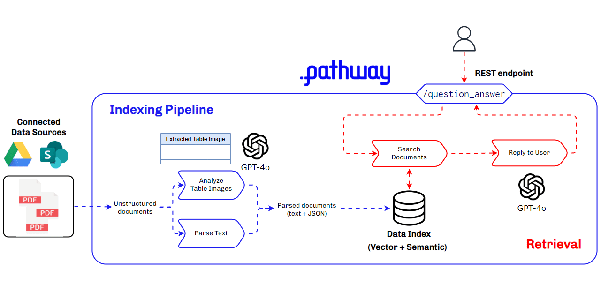

## Multimodal RAG with Pathway

Get started with multimodal RAG using `GPT-4o` and Pathway. This showcase demonstrates a document processing pipeline that utilizes LLMs in the parsing stage. Pathway extracts information from unstructured financial documents, updating results as documents change or new ones arrive. 

We specifically use `GPT-4o` to improve the table data extraction accuracy and demonstrate how this approach outperforms the industry-standard RAG toolkits.

We focused on the finance domain because financial documents often rely heavily on tables in various forms. This showcase highlights the limitations of traditional RAG setups, which struggle to answer questions based on table data. By contrast, our multimodal RAG approach excels in extracting accurate information from tables.

We use the `GPT-4o` in two parts:
- Extracting and understanding the tables inside the PDF
- Answering questions with the retrieved context



## Introduction

We will use `BaseRAGQuestionAnswerer` provided under `pathway.xpacks` to get started on our RAG application with very minimal overhead. This module brings together the foundational building bricks for the RAG application. 

It includes ingesting the data from the sources, calling the LLM, parsing and chunking the documents, creating and querying the database (index) and also serving the app on an endpoint. 

For more advanced RAG options, make sure to check out [rerankers](https://pathway.com/developers/api-docs/pathway-xpacks-llm/rerankers) and the [adaptive rag example](../adaptive-rag/).


## Modifying the code

Under the main function, we define:
- input folders
- LLM
- embedder
- index
- host and port to run the app
- run options (caching, cache folder)

You can modify any of the components by checking the options from the imported modules: `from pathway.xpacks.llm import embedders, llms, parsers, splitters`.

It is also possible to easily create new components by extending the [`pw.UDF`](https://pathway.com/developers/user-guide/data-transformation/user-defined-functions) class and implementing the `__wrapped__` function.


## Running the app

> Note: Recommended way of running the Pathway on Windows is Docker, refer to [Running with the Docker section](#with-docker).

First, make sure to install the requirements by running:
```bash
pip install -r requirements.txt
```
Then, create a `.env` file in this directory and put your API key with `OPENAI_API_KEY=sk-...`, or add the `api_key` argument to `OpenAIChat` and `OpenAIEmbedder`. 

Then, simply run with `python app.py` in this directory.

### With Docker

First, make sure to have your OpenAI API key in the environment, you can create a `.env` file as mentioned above, or specify the `api_key` argument in the `OpenAIChat` and `OpenAIEmbedder`. 

In order to let the pipeline get updated with each change in local files, you need to mount the `data` folder inside the docker. The following commands show how to do that.

The following commands will:
- mount the `data` folder inside the Docker
- build the image
- run the app and expose the port `8000`.

You can omit the ```-v `pwd`/data:/app/data``` part if you are not using local files as a data source. 

```bash
# Make sure you are in the right directory.
cd examples/pipelines/gpt_4o_multimodal_rag/

# Build the image in this folder
docker build -t rag .

# Run the image, mount the `data` folder into image and expose the port `8000`
docker run -v `pwd`/data:/app/data -p 8000:8000 rag
```

## Using the app

After running the app, you will see the logs about the files being processed, after the logs stop streaming, the app is ready to receive requests.

First, let's check the files that are currently indexed:
```bash
curl -X 'POST'   'http://0.0.0.0:8000/v1/pw_list_documents'   -H 'accept: */*'   -H 'Content-Type: application/json'
```

This will return the list of files as follows:
> `[{"modified_at": 1715765613, "owner": "berke", "path": "data/20230203_alphabet_10K.pdf", "seen_at": 1715768762}]`

Now, let's ask a question from one of the tables inside the report. In our tests, regular RAG applications struggled with the tables and couldn't answer to this question correctly.

```bash
curl -X 'POST'   'http://0.0.0.0:8000/v1/pw_ai_answer'   -H 'accept: */*'   -H 'Content-Type: application/json'   -d '{
  "prompt": "How much was Operating lease cost in 2021?" 
}'
```
> `$2,699 million`

This response was correct thanks to the initial LLM parsing step. 
When we check the context that is sent to the LLM, we see that Pathway included the table in the context where as other RAG applications failed to include the table.

The following GIF shows a snippet from our experiments:


Let's try another one,

```bash
curl -X 'POST'   'http://0.0.0.0:8000/v1/pw_ai_answer'   -H 'accept: */*'   -H 'Content-Type: application/json'   -d '{
  "prompt": "What is the operating income for the fiscal year of 2022?" 
}'
```
> `$74,842 million`

Another example, let's ask a question that can be answered from the table on the 48th page of the PDF.

```bash
curl -X 'POST'   'http://0.0.0.0:8000/v1/pw_ai_answer'   -H 'accept: */*'   -H 'Content-Type: application/json'   -d '{
  "prompt": "How much was Marketable securities worth in 2021 in the consolidated balance sheets?"                                              
}'
```
> `$118,704 million`

## Conclusion

This showcase demonstrates setting up a powerful RAG pipeline with advanced table parsing capabilities, unlocking new finance use cases. While we've only scratched the surface, there's more to explore:

- Re-ranking: Prioritize the most relevant results for your specific query.
- Knowledge graphs: Leverage relationships between entities to improve understanding.
- Hybrid indexing: Combine different indexing strategies for optimal retrieval.
- Adaptive reranking: Iteratively enlarge the context for optimal accuracy, see [our example](../adaptive-rag/README.md).
Stay tuned for future examples exploring these advanced techniques with Pathway!

RAG applications are most effective when tailored to your specific use case. Here's how you can customize yours:

- Document parsers and splitters: Fine-tune how documents are processed and broken down for analysis.
- Indexing and retrieval strategies: Choose the most efficient approach for your data and search needs.
- User Interface (UI): Design a user-friendly interface that caters to your end users' workflows.

Ready to Get Started?

Let's discuss how we can help you build a powerful, customized RAG application. [Reach us here!](https://pathway.com/solutions/enterprise-generative-ai?modal=requestdemo)
